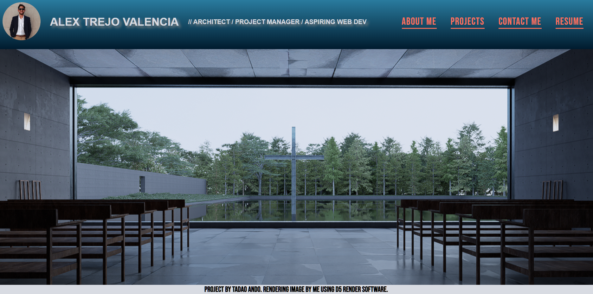
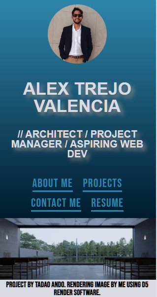

# Personal-Portfolio-Challenge
This repo was created to host a personal portfolio to showcase coding skills and personal projects.

## Description

This portfolio was made to display the architectural projects I've done so far as well as the Web Applications I've done ever since I started learning web development.

## Mockup

The site should look like the following (desktop view):

And on mobile the design should look something like this:

## Link

Follow this URL to access the website: https://alextrejo92.github.io/Personal-Portfolio-Challenge/

## Installation

N/A

## Credits

The page was designed by me following a mockup provided by EdX & Tec de Monterrey.

## License

Standard MIT license.